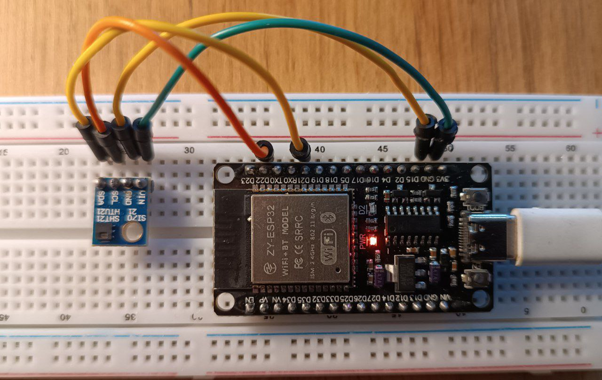

# MeteoStation 🌤️

Проект автономной метеостанции на базе микроконтроллера **NodeMCU ESP32** с датчиком **SHT21**. Система состоит из трех основных компонентов: прошивки для устройства, бэкенд-сервера для сбора данных и веб-интерфейса для их визуализации.



## 🚀 Основные возможности

- **Сбор данных:** Измерение температуры и влажности с помощью датчика SHT21
- **Передача данных:** Автоматическая отправка показаний на сервер по Wi-Fi
- **Хранение данных:** Серверная часть на Node.js с использованием SQLite для надежного хранения истории измерений
- **Визуализация:** Удобный веб-интерфейс на React для просмотра текущих показаний и построения графиков
- **Аналитика:** Статистика, фильтрация по периодам, агрегация данных

## 📁 Структура проекта

```
meteostation/
├── embedded/              # Прошивка для ESP32 (PlatformIO)
│   ├── src/
│   ├── .pio/
│   ├── .vscode/
│   └── platformio.ini
├── backend/               # Серверная часть (Node.js/Express + SQLite)
│   ├── server.js          # Главный файл сервера
│   ├── package.json
│   ├── package-lock.json
│   ├── sensor_data.db     # База данных (создается автоматически)
│   └── node_modules/
├── frontend/              # Клиентская часть (Create React App)
│   ├── src/
│   ├── public/
│   ├── package.json
│   ├── package-lock.json
│   ├── .env               # Переменные окружения
│   └── node_modules/
├── images/                # Изображения проекта
│   └── meteo-station.jpg
└── README.md
```

## ⚙️ Настройка и запуск

### 1. Прошивка для ESP32 (Папка `embedded`)

Для работы с проектом требуется PlatformIO.

1.  Откройте папку `embedded` в VS Code с установленным расширением PlatformIO
2.  Настройте параметры подключения к Wi-Fi и адрес сервера в файле `src/main.cpp`:
    ```cpp
    const char* ssid = "ВАШ_SSID";
    const char* password = "ВАШ_ПАРОЛЬ";
    const char* serverUrl = "http://IP_ВАШЕГО_СЕРВЕРА:3000/data";
    ```
3.  Подключите датчик SHT21 к ESP32 по I2C (обычно контакты SDA - GPIO21, SCL - GPIO22)
4.  Прошейте устройство, используя кнопку `Upload` в PlatformIO

### 2. Серверная часть (Папка `backend`)

1.  Перейдите в папку `backend`
2.  Установите зависимости:
    ```bash
    npm install
    ```
3.  Запустите сервер:
    ```bash
    npm start
    ```
    Сервер будет запущен на порту 3000 (http://localhost:3000)

### 3. Веб-интерфейс (Папка `frontend`)

1.  Перейдите в папку `frontend`
2.  Настройте переменные окружения. Создайте/отредактируйте файл `.env`:
    ```env
    REACT_APP_API_BASE_URL=http://localhost:3000
    ```
3.  Установите зависимости:
    ```bash
    npm install
    ```
4.  Запустите сервер для разработки:
    ```bash
    npm start
    ```
    Приложение будет доступно по адресу http://localhost:3001

## 🌐 API Endpoints

### Основные endpoints

| Метод      | Endpoint            | Описание                             | Параметры                                     |
| ---------- | ------------------- | ------------------------------------ | --------------------------------------------- |
| **POST**   | `/data`             | Добавление данных с датчика          | `temperature`, `humidity`, `timestamp` (опц.) |
| **GET**    | `/data`             | Получение данных с пагинацией        | `period`, `page`, `limit`                     |
| **GET**    | `/data/chart`       | Данные для графиков (агрегированные) | `period`, `aggregate`                         |
| **GET**    | `/stats`            | Статистика по данным                 | `period`                                      |
| **GET**    | `/data/:id`         | Получение конкретной записи          | -                                             |
| **PUT**    | `/data/:id`         | Обновление записи                    | `temperature`, `humidity`, `timestamp`        |
| **DELETE** | `/data/:id`         | Удаление записи                      | -                                             |
| **POST**   | `/data/bulk-delete` | Массовое удаление                    | `ids[]`                                       |
| **GET**    | `/health`           | Проверка работоспособности           | -                                             |

### Параметры запросов

**Периоды (period):**

- `hour` - данные за последний час
- `day` - данные за последние 24 часа
- `week` - данные за последнюю неделю
- `month` - данные за последний месяц
- `all` - все данные (по умолчанию)

**Агрегация (aggregate):**

- `minute` - группировка по минутам
- `hour` - группировка по часам (по умолчанию)
- `day` - группировка по дням

### Примеры запросов

```
# Получить данные за последние 24 часа
GET http://localhost:3000/data?period=day&page=1&limit=10

# Получить данные для графика за неделю с группировкой по часам
GET http://localhost:3000/data/chart?period=week&aggregate=hour

# Получить статистику за месяц
GET http://localhost:3000/stats?period=month

# Добавить новые данные
POST http://localhost:3000/data
Content-Type: application/json

{
  "temperature": 23.5,
  "humidity": 45.2
}
```

## 🛠️ Технологии

- **Встроенная часть (Embedded):** C++, PlatformIO, Framework Arduino (для ESP32)
- **Датчик:** SHT21 (Temperature & Humidity)
- **Бэкенд (Backend):** Node.js, Express.js, SQLite
- **Фронтенд (Frontend):** React, Create React App

## 🌐 Переменные окружения (Frontend)

Во фронтенде используется файл `.env` для настройки:

- `REACT_APP_API_URL` - URL бэкенд-сервера

## 🤝 Развитие проекта

Возможные идеи для улучшения:

- Добавление новых датчиков (давление, качество воздуха).
- Реализация оповещений (e-mail, Telegram) при выходе значений за заданные пределы.
- Настройка OTA-обновлений (Over-The-Air) для прошивки ESP32.
- Улучшение интерфейса: добавление тем, более детальных графиков.

---

**Автор:** Maks Rygaev

Если у вас есть вопросы или предложения, создавайте Issue в этом репозитории.
